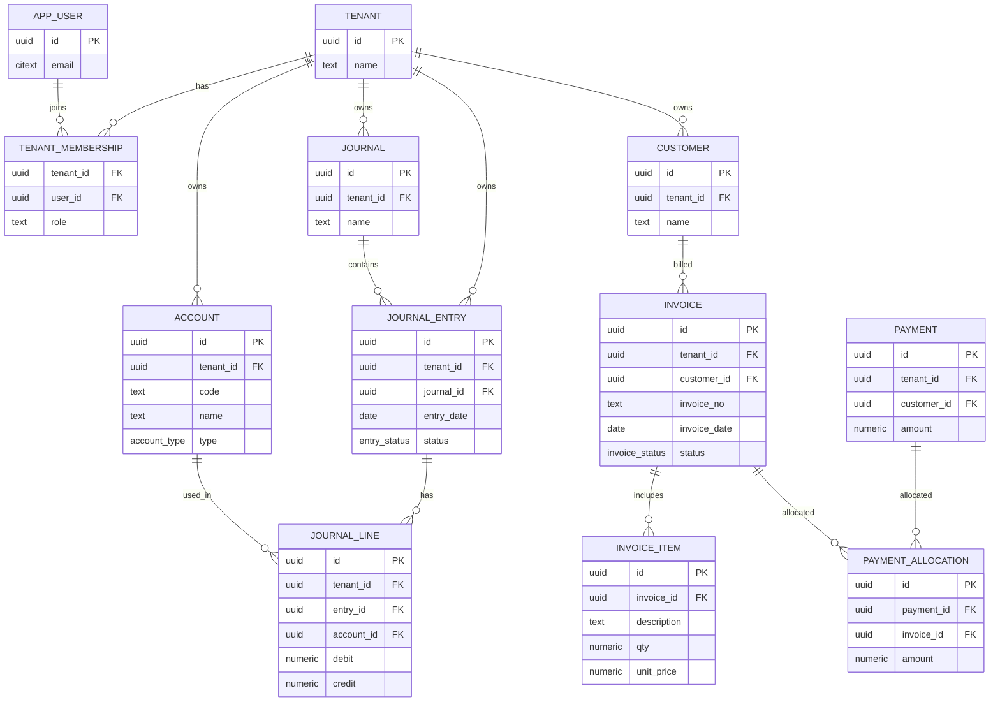

# ERD (Mermaid)

```mermaid
erDiagram
  TENANT ||--o{ TENANT_MEMBERSHIP : has
  APP_USER ||--o{ TENANT_MEMBERSHIP : joins

  TENANT ||--o{ ACCOUNT : owns
  TENANT ||--o{ JOURNAL : owns
  TENANT ||--o{ JOURNAL_ENTRY : owns
  JOURNAL ||--o{ JOURNAL_ENTRY : contains
  JOURNAL_ENTRY ||--o{ JOURNAL_LINE : has
  ACCOUNT ||--o{ JOURNAL_LINE : used_in

  TENANT ||--o{ CUSTOMER : owns
  CUSTOMER ||--o{ INVOICE : billed
  INVOICE ||--o{ INVOICE_ITEM : includes
  INVOICE ||--o{ PAYMENT_ALLOCATION : allocated
  PAYMENT ||--o{ PAYMENT_ALLOCATION : allocated

  TENANT {
    uuid id PK
    text name
  }

  APP_USER {
    uuid id PK
    citext email
  }

  TENANT_MEMBERSHIP {
    uuid tenant_id FK
    uuid user_id FK
    text role
  }

  ACCOUNT {
    uuid id PK
    uuid tenant_id FK
    text code
    text name
    account_type type
  }

  JOURNAL {
    uuid id PK
    uuid tenant_id FK
    text name
  }

  JOURNAL_ENTRY {
    uuid id PK
    uuid tenant_id FK
    uuid journal_id FK
    date entry_date
    entry_status status
  }

  JOURNAL_LINE {
    uuid id PK
    uuid tenant_id FK
    uuid entry_id FK
    uuid account_id FK
    numeric debit
    numeric credit
  }

  CUSTOMER {
    uuid id PK
    uuid tenant_id FK
    text name
  }

  INVOICE {
    uuid id PK
    uuid tenant_id FK
    uuid customer_id FK
    text invoice_no
    date invoice_date
    invoice_status status
  }

  INVOICE_ITEM {
    uuid id PK
    uuid invoice_id FK
    text description
    numeric qty
    numeric unit_price
  }

  PAYMENT {
    uuid id PK
    uuid tenant_id FK
    uuid customer_id FK
    numeric amount
  }

  PAYMENT_ALLOCATION {
    uuid id PK
    uuid payment_id FK
    uuid invoice_id FK
    numeric amount
  }
```
